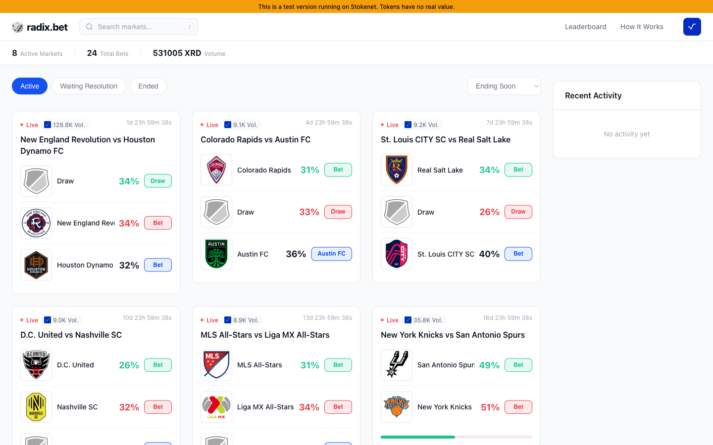
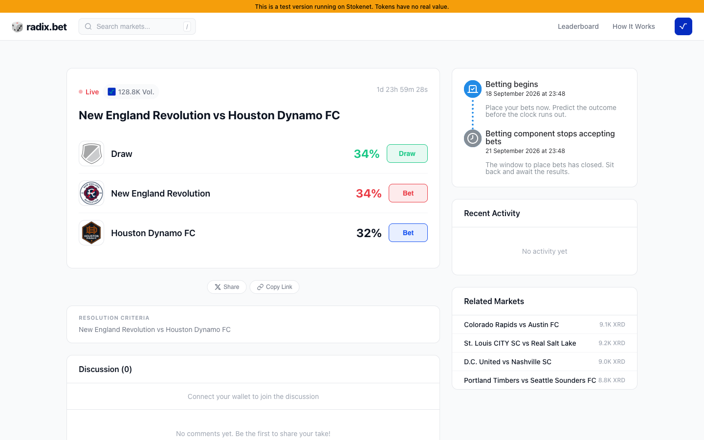

# radix.bet

A Polymarket-style prediction market built on [Radix DLT](https://www.radixdlt.com/)
— Scrypto smart contract, SvelteKit web app, React admin panel, and an event
processor that follows the ledger.

**This is a playground, not a product.** It runs on your machine against
Stokenet, Radix's public testnet, where XRD is free from a faucet and worth
nothing. There is no deployment pipeline here on purpose: no Dockerfiles, no CI,
no infrastructure. Clone it, run it, take it apart.



## Why it exists

radix.bet was a real product. It is not shipping: Polish gambling law makes a
mainnet launch untenable, so the code sat in a private monorepo doing nothing.
It is more useful in the open.

If you are looking for a non-trivial, working example of the Radix stack — a
Scrypto blueprint with a real lifecycle, ROLA wallet authentication, transaction
manifests built server-side, gateway state reads, and an event processor
reconciling on-ledger truth with a database — that is what this is.

It is also a working reference for [hookah.ing](https://app.hookah.ing), which
is how everything here finds out that anything happened on-ledger, and it ships
with an [ESPN-driven oracle](#the-oracle-markets-that-create-and-settle-themselves)
that creates and settles sports markets end to end with no human in the loop.

## What a prediction market does here

Someone creates a market: a question, a deadline, and two or more outcomes. Each
outcome is its own fungible token on-ledger. You bet by buying the token for the
outcome you think will happen, and the XRD you pay joins the prize pool. When the
deadline passes, the market's owner marks the winning outcome, and holders of
that outcome's token redeem it for a share of the pool.

```
create_bet()  →  [ACTIVE: voting open]
                       ↓ deadline passes
                 [VOTING_CLOSED]
                       ↓ owner calls mark_winning_option()
                 [RESOLVED]
                       ↓ winners call claim_prize()
                 prize pool distributed
```

The payout is `total_prize_pool / winning_option_total_supply` per token — so the
less popular the winning outcome was, the more each winning token is worth. The
owner badge is a non-divisible token that is **burned** when the winner is
marked, which is what stops a market being resolved twice.



## Running it

You need [Node 20+](https://nodejs.org), [pnpm](https://pnpm.io), and Docker for
the local Postgres and Valkey.

```bash
git clone https://github.com/owlcode/radix.bet.git
cd radix.bet
cp .env.example .env
pnpm setup      # install, start services, create schema, seed demo markets
pnpm dev:web    # http://localhost:5173
```

`pnpm setup` is the four steps below, if you would rather run them yourself:

```bash
pnpm install
pnpm services:up     # Postgres on :5433, Valkey on :6380
pnpm db:generate     # Prisma client
pnpm db:push         # create the schema
pnpm db:seed         # 24 demo markets
```

The ports are deliberately offset from the defaults so this does not fight a
Postgres or Redis you already have running. `pnpm services:down` stops them.

### What the seed data is

Real markets from the Stokenet deployment: real component and resource
addresses, real option names, real vote totals — mostly MLS and NBA fixtures
that were created by an ESPN oracle. It carries no personal data. The accounts
that created them are replaced with a single demo identity, and individual votes
are not included, only the per-option totals that were already public on-ledger.

Deadlines are rewritten relative to when you run the seed, so roughly a third of
the markets are open and the rest are settled. Re-running it is safe.

### Running the other pieces

```bash
pnpm dev                        # everything at once
pnpm --filter @radix-bet/admin dev            # admin panel
pnpm --filter @radix-bet/event-processor dev  # ledger event processor
```

The web app reads seeded markets with no wallet and no blueprint deployed. To go
further you will want the [Radix Wallet](https://wallet.radixdlt.com/) with a
Stokenet account.

## The smart contract

`scrypto/src/lib.rs` — blueprint `PublicBetMultipleWinners`, package `owl-bets`.

```bash
pnpm scrypto:test     # cargo test, no network needed
pnpm scrypto:build    # requires the scrypto CLI
```

Building needs the [Scrypto toolchain](https://docs.radixdlt.com/docs/getting-rust-scrypto).
`cargo test` alone works with plain Rust.

### Deploying the blueprint

Only needed if you want to *create* markets rather than browse seeded ones.

```bash
pnpm accounts:generate   # a Stokenet keypair, written to .accounts.json
pnpm faucet              # free testnet XRD
pnpm scrypto:build
pnpm scrypto:publish     # prints the package address
```

Put the printed address in `RADIX_PACKAGE_ADDRESS` in `.env` and restart the dev
server.

## Layout

| Path | What it is |
| --- | --- |
| `scrypto/` | The Scrypto blueprint, its tests and transaction manifests |
| `apps/web/` | SvelteKit front end — market list, market view, creation, profile |
| `apps/admin/` | React + Vite admin panel — categories, oracle games, resolution |
| `apps/event-processor/` | Express + BullMQ worker following ledger events; `src/hookah/` is the hookah.ing integration, `src/oracle/` the ESPN oracle |
| `packages/database/` | Prisma schema, client and the demo seed |
| `packages/radix/` | Gateway client, manifest builders, account helpers |
| `packages/types/` | Shared TypeScript types |
| `packages/config/` | Network and address configuration |
| `packages/queue/` | BullMQ queue definitions |
| `packages/integration-tests/` | Stokenet lifecycle tests (hits the real testnet) |

[`docs/ARCHITECTURE.md`](docs/ARCHITECTURE.md) goes deeper — the auth flow, the
API surface, the event pipeline and the resolution rules.

## The oracle: markets that create and settle themselves

Nobody wrote those 24 seeded markets by hand. They were created, and most of
them resolved, by an oracle that reads [ESPN](https://www.espn.com/)'s public
scoreboard and drives the whole lifecycle on-ledger without a human in it.

`apps/event-processor/src/oracle/` is that engine. A game moves through four
states:

```
DISCOVERED ──create──▶ BET_CREATED ──settle──▶ RESOLVED
     │                      │
     └──▶ BET_FAILED        └──▶ RESOLUTION_FAILED
```

Both failure states are terminal and deliberate: a game that could not be turned
into a market, and a market that could not be settled from the data available.

1. **Fetch** (`fetch-games.ts`, `espn.ts`) — polls ESPN on an interval for
   upcoming fixtures, and records each as an `OracleGame` in `DISCOVERED`.
2. **Create** (`create-bet.ts`) — builds and submits the `create_bet`
   transaction: one option per team, plus a draw option for leagues that allow
   one, deadline set to kick-off, team badges as option images.
3. **Resolve** (`resolve-bet.ts`) — once ESPN reports the game final, works out
   the winner from the box score and submits `mark_winning_option`, burning the
   owner badge.

Configured out of the box (`oracle/configs.ts`): **NBA**, and football for the
Premier League, La Liga, Serie A, Bundesliga, Ligue 1, Champions League and MLS.
Leagues carry a `hasDraw` flag, which is what decides whether a market gets two
outcomes or three.

The interesting part is what it does when it *cannot* decide. If ESPN reports no
winner and the league does not allow draws, or the component and badge addresses
needed for the mark-winner transaction are missing, the game goes to
`RESOLUTION_FAILED` with a logged reason rather than guessing. A market that
settles wrongly is worse than one that does not settle — so nothing is ever
resolved on an assumption.

Both halves have kill switches (`oracle:create:enabled`, `oracle:resolve:enabled`)
held in runtime config and toggleable from the admin panel, so creation and
resolution can be stopped independently without a redeploy.

Running it needs the event processor, a deployed blueprint and a funded account,
since every create and resolve is a real signed transaction. The admin panel's
Oracle page lists discovered games and their state.

## How it watches the ledger: hookah.ing

This is the part worth stealing, and the part radix.bet was built around.

A prediction market only works if the app knows what happened on-ledger — a
market created, a vote cast, a winner marked, a prize claimed. Polling the
gateway for every component you care about does not scale past a few markets,
and misses things when it is down.

radix.bet delegates that to **[hookah.ing](https://app.hookah.ing)**, a service
that watches Radix for you and posts a webhook when a specific component emits a
specific event. `apps/event-processor/src/hookah/` is the whole integration:

1. **Authenticate.** Ed25519 keypair via `hookah-sdk` — the processor signs a
   challenge with its private key under the persona `radixbet-event-processor`.
   No password, same shape as the wallet login below.
2. **Register a webhook.** One URL, with a shared secret sent as
   `x-webhook-signature`.
3. **Create triggers.** A trigger is an `(emitter address, event name)` pair.
   One sits on the *package* address for `BetCreatedEvent`, so every new market
   is caught without knowing about it in advance. Each market then gets its own
   component-level triggers for votes, resolution and claims.
4. **Receive and reconcile.** `POST /api/webhook/events` validates the
   signature, decodes the SBOR event payload, and routes it into BullMQ queues
   that write to Postgres.

The `HookahTrigger` table mirrors what is registered remotely, so startup can
reconcile the two: stale package triggers from a previous `RADIX_PACKAGE_ADDRESS`
are removed, orphaned component triggers for markets that no longer exist are
cleaned up, and nothing is registered twice. That reconciliation
(`hookah/setup.ts`) is the piece that makes a webhook-driven indexer survive
redeploys.

**You do not need it to run the playground.** The seeded markets are already in
the database and the web app reads them directly. You need it only to follow a
*live* ledger — which means deploying your own blueprint and running the event
processor with:

```bash
HOOKAH_BASE_URL=https://app.hookah.ing
HOOKAH_PUBLIC_KEY=...        # your persona keypair
HOOKAH_PRIVATE_KEY=...
HOOKAH_WEBHOOK_URL=...       # publicly reachable; use a tunnel locally
HOOKAH_WEBHOOK_SECRET=...
```

The webhook URL has to be reachable from the internet, so for local work you
want ngrok or similar in front of the event processor.

## How the wallet login works

Radix has no passwords. The web app uses **ROLA** (Radix Off-Ledger
Authentication): the server issues a 32-byte random challenge, the user signs it
in their Radix Wallet, and the server verifies the signature against the
account's on-ledger public key with `@radixdlt/rola`. A successful verification
issues a JWT session cookie. There is no account table to breach, because there
is no credential to store.

## Things worth knowing before you build on it

- **This code has not had a security review.** It was written for a product that
  never launched. Read it as a reference, not as something to put real value
  through.
- **Money makes it a regulated activity.** Prediction markets are gambling in
  many jurisdictions — that is exactly why this one stopped. If you point it at
  mainnet, that is your legal problem to solve, not a technical one.
- **`RADIX_PACKAGE_ADDRESS` is deployment-specific.** Markets created against one
  package are invisible to an app configured for another.
- **`pnpm check` reports 9 type errors.** They came with the code and are
  carried over unchanged rather than papered over: Radix SDK drift
  (`resourceHoldersPage`, `MetadataTypedValue`) and some loose DOM typing in
  image error handlers. The app runs; these are worth fixing if you build on it.
- **Integration tests hit the real testnet.** `packages/integration-tests` needs
  a funded Stokenet account and will be slow.

## Licence

MIT — see [LICENSE](LICENSE).
